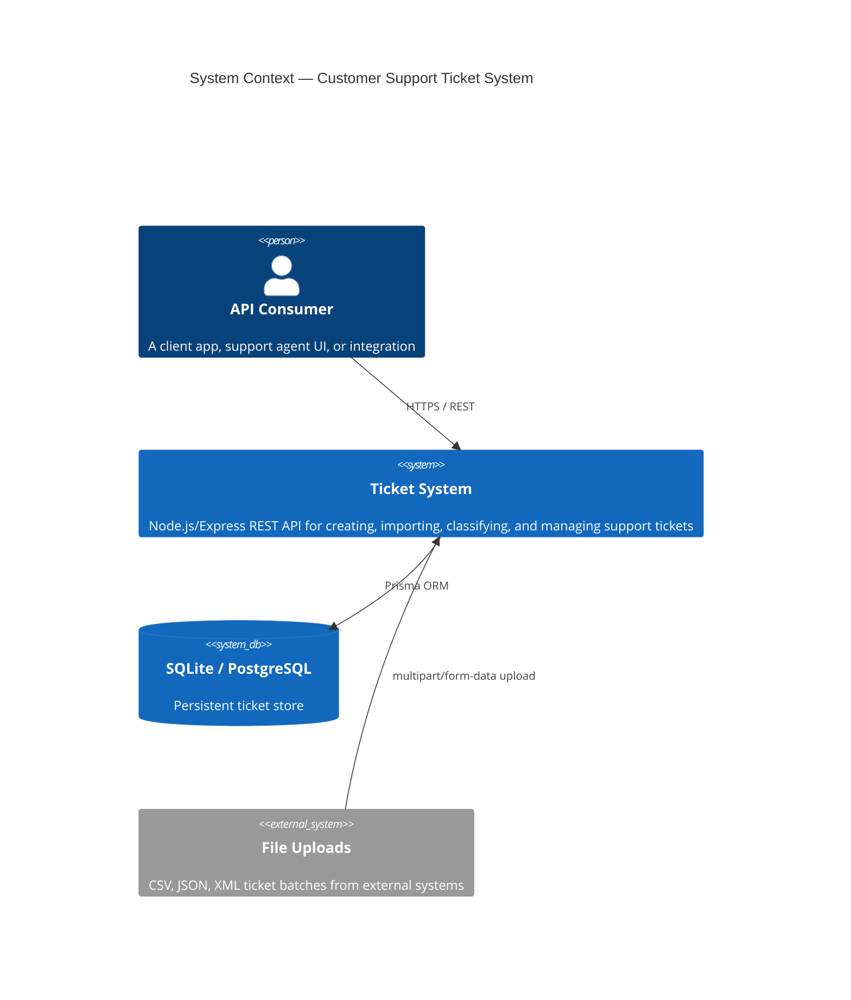
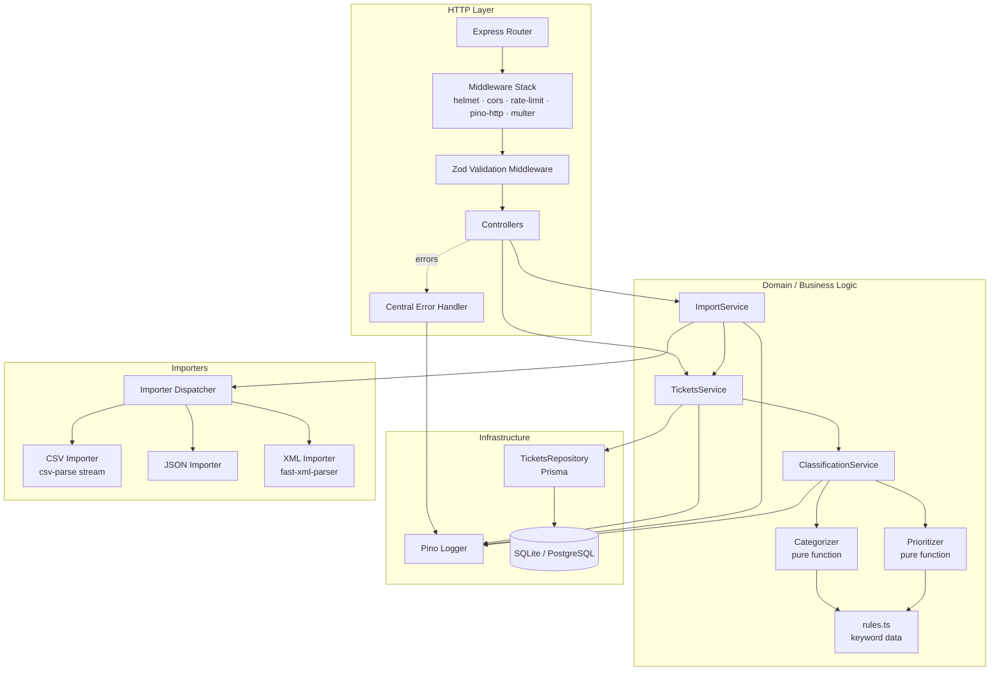
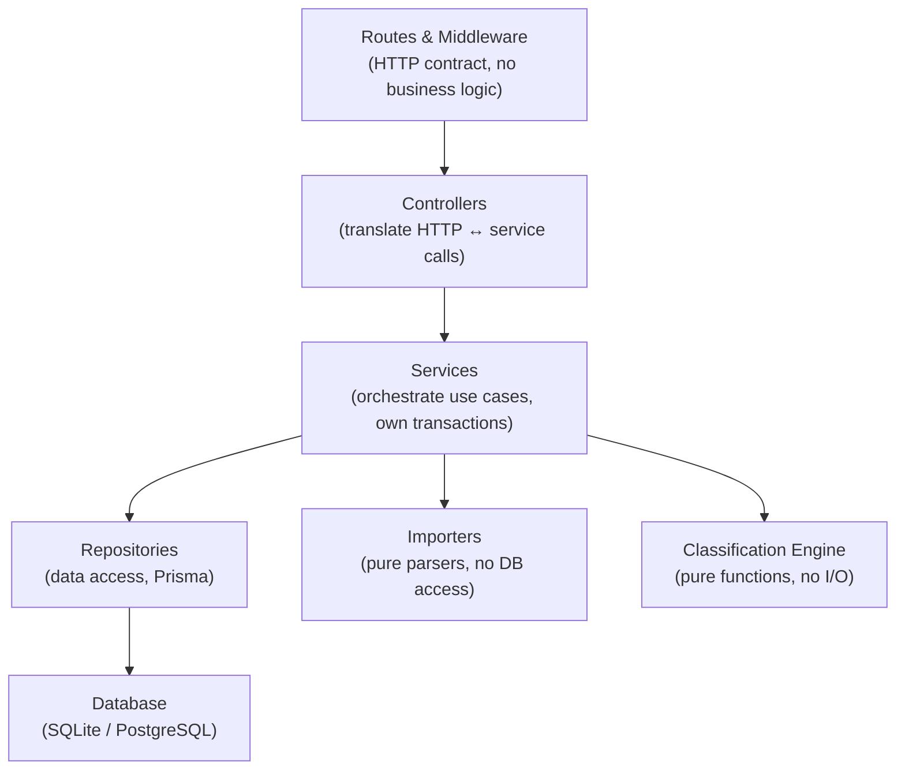
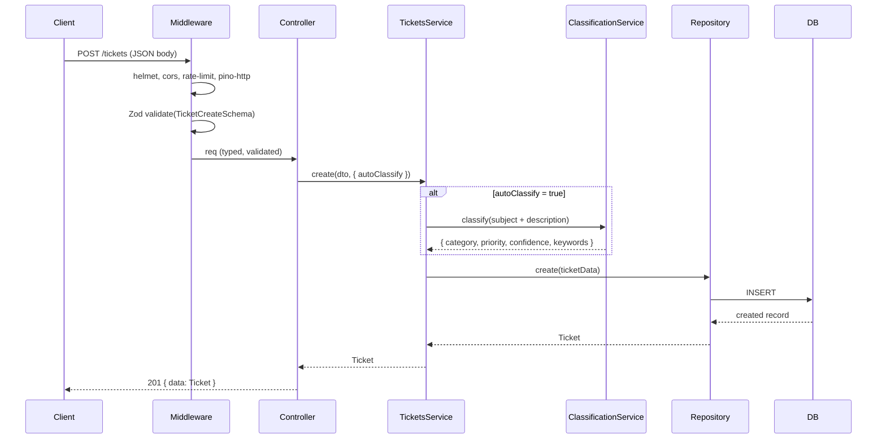
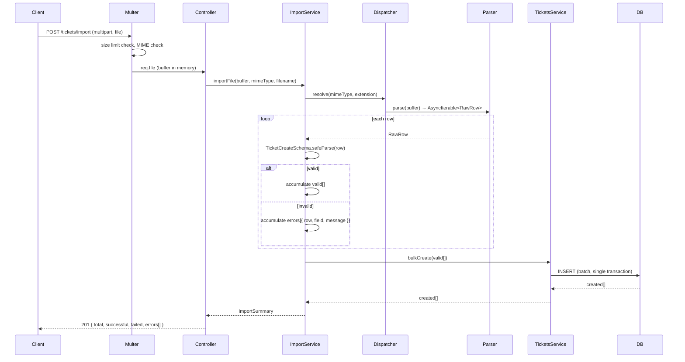
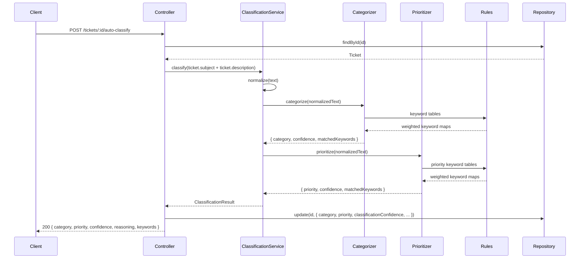
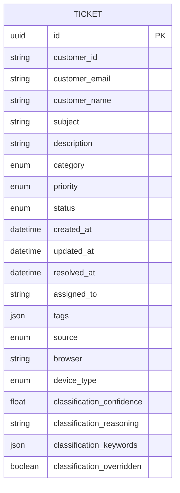

# Architecture — Intelligent Customer Support Ticket System

## Table of Contents

1. [High-Level Context](#1-high-level-context)
2. [Component Overview](#2-component-overview)
3. [Layered Architecture](#3-layered-architecture)
4. [Request Data Flow](#4-request-data-flow)
5. [Bulk Import Flow](#5-bulk-import-flow)
6. [Auto-Classification Flow](#6-auto-classification-flow)
7. [Module Descriptions](#7-module-descriptions)
8. [Data Model](#8-data-model)
9. [Design Decisions & Trade-offs](#9-design-decisions--trade-offs)
10. [Security Considerations](#10-security-considerations)
11. [Performance Considerations](#11-performance-considerations)

---

## 1. High-Level Context



The system is a standalone REST service. All state lives in a relational database managed through **Prisma ORM**, which supports both SQLite (development) and PostgreSQL (production) without code changes.

---

## 2. Component Overview



---

## 3. Layered Architecture

The system is a **layered monolith** (hexagonal-lite). Each layer has a single responsibility and depends only on the layer below it.



**Strict rules that are enforced:**

- Controllers never access the database directly; they call services.
- Services never construct HTTP responses; they throw typed errors.
- Importers and classification functions are **pure** — no I/O, no side effects. This makes them trivially unit-testable.
- The repository is the only module allowed to import Prisma.

---

## 4. Request Data Flow

Sequence for a standard `POST /tickets` request:



---

## 5. Bulk Import Flow



---

## 6. Auto-Classification Flow



---

## 7. Module Descriptions

### `src/app.ts`
Express application factory. Registers all middleware and routes in a deterministic order. Does **not** call `.listen()` — that is done in `server.ts`. This separation allows Supertest to drive the app in tests without binding a port.

### `src/config/env.ts`
Parses `process.env` through a Zod schema at startup. If any required variable is missing or invalid, the process exits immediately with a descriptive error. This implements the **fail-fast** principle for configuration.

### `src/domain/ticket.schema.ts`
Single source of truth for the Ticket shape. Exports:
- `TicketCreateSchema` — validated input from clients/importers
- `TicketSchema` — full persisted record
- `TicketQuerySchema` — validated query parameters for `GET /tickets`
- TypeScript types inferred via `z.infer<>`

### `src/classification/categorizer.ts` and `prioritizer.ts`
Pure functions. They receive a normalized text string and return a result object. No imports from Express, Prisma, or any I/O module. Category and priority keyword tables are kept in the separate `rules.ts` data file so they can be updated without touching algorithm logic.

**Confidence calculation:**
```
confidence = min(1.0, totalMatchedWeight / categoryThreshold)
```
When the top-2 candidates are within 15% of each other, the function falls back to `other` / `medium` with a low confidence score to prevent false certainty.

### `src/importers/`
Each importer is a module that accepts a `Buffer` and returns an `AsyncIterable<unknown>`. The dispatcher selects the importer by checking both the MIME type and file extension (defense in depth). The streaming approach means CSV files of any size are processed without loading them entirely into memory.

### `src/repositories/tickets.repository.ts`
The only module allowed to use the Prisma client. Exposes typed methods: `create`, `findById`, `findMany` (with filter/pagination/sort), `update`, `delete`, `createMany`. This hides Prisma from the service layer, making it easy to swap the database adapter in tests.

### `src/api/middleware/errorHandler.ts`
Maps the `AppError` hierarchy to HTTP responses:

| Error class | HTTP status |
|---|---|
| `ValidationError` | 400 |
| `NotFoundError` | 404 |
| `ConflictError` | 409 |
| `UnprocessableError` | 422 |
| `UnsupportedMediaError` | 415 |
| Unhandled / unknown | 500 |

In production, 500 responses never include a stack trace.

---

## 8. Data Model



All timestamps are stored in UTC and returned in ISO-8601 format. `resolved_at` is `null` until the ticket transitions to `resolved` or `closed` status. The service validates that `resolved_at` cannot precede `created_at`.

---

## 9. Design Decisions & Trade-offs

### Why SQLite for development / PostgreSQL for production?
Prisma makes switching transparent — only the `DATABASE_URL` changes. SQLite eliminates infra setup for local development and CI. The same migration files apply to both engines.

### Why Zod instead of Joi or class-validator?
Zod schemas derive TypeScript types via `z.infer<>`, eliminating the duplication of a separate interface and a runtime schema. Zod also integrates with `@asteasolutions/zod-to-openapi` to generate an OpenAPI 3.1 spec automatically.

### Why a rule-based classifier instead of an ML model?
The spec is explicitly keyword-driven. A rule-based engine is deterministic, fully testable, and has zero inference latency. It requires no model hosting or API key. The confidence scoring makes it honest about uncertainty. Upgrading to an ML-backed classifier later is straightforward — the `ClassificationService` is behind an interface.

### Why streaming CSV parsing?
`csv-parse` with the streaming API processes rows as they arrive from the buffer, never loading the entire file into memory. This keeps memory usage constant at O(batch_size) regardless of file size, which is important for large bulk imports.

### Why `app.ts` separate from `server.ts`?
Supertest can import `app` and make requests without binding a real TCP port. This makes integration tests faster, parallel-safe (no port conflicts), and avoids `EADDRINUSE` errors in CI.

### Why pure functions for classification?
Pure functions are deterministic, side-effect free, and require no mocking. The test for `categorize("can't access my account")` is a single line with no setup. They also compose trivially — the service calls them in sequence without coupling.

---

## 10. Security Considerations

| Concern | Mitigation |
|---|---|
| HTTP hardening | `helmet` sets secure headers on every response |
| CORS | Explicit allowlist in config, not `*` |
| Rate limiting | `express-rate-limit` — 100 req/15 min per IP by default |
| File upload abuse | `multer` limits: `fileSize: 10 MB`, `files: 1`; MIME allowlist; extension cross-check |
| XML injection (XXE / Billion Laughs) | `fast-xml-parser` configured with `processEntities: false` |
| SQL injection | Impossible via Prisma's parameterized queries |
| Stack trace leakage | Error handler strips stack traces in `NODE_ENV=production` |
| PII in logs | `customer_email` masked in Pino serializers |
| Env secret exposure | All secrets are in `.env` (gitignored); Zod validates at boot |
| Large payloads | `express.json({ limit: '1mb' })` on JSON body parser |

---

## 11. Performance Considerations

| Concern | Strategy |
|---|---|
| Bulk insert | Single Prisma `createMany` call per import batch in one transaction |
| CSV streaming | Row-by-row streaming prevents memory spikes |
| DB indexing | Indexes on `category`, `priority`, `status`, `created_at` for common filter queries |
| Classification latency | Pure synchronous regex matching — sub-millisecond per ticket |
| Response payload | Pagination defaults: `pageSize=20`, max `100`; prevents unbounded list responses |
| Logging overhead | Pino is the fastest Node.js logger; async transport in production |
| Cold start | Prisma client singleton instantiated once on module load |
