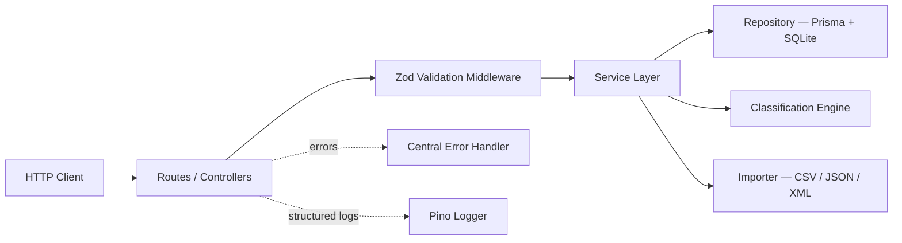

# Intelligent Customer Support Ticket System

> **Student Name**: Rusnak Dmytro
> **Date Submitted**: 05.05.2026
> **AI Tools Used**: Cursor

---

## Project Overview

A RESTful customer support ticket management system built with **Node.js + Express + TypeScript**. It accepts tickets via a CRUD API, bulk-imports them from **CSV, JSON, and XML** files, and automatically classifies each ticket by **category** and **priority** using a keyword-rule engine. The architecture follows a layered (hexagonal-lite) pattern with a clean separation between routes, controllers, services, repositories, and pure-function domain logic.

Key features:

- Multi-format bulk import (CSV / JSON / XML) with per-row error reporting
- Rule-based auto-classification: 6 categories × 4 priority levels, with confidence scores
- Full CRUD REST API with filtering, pagination, and sorting
- Zod-validated request/response schemas that double as OpenAPI spec source
- Structured JSON logging (Pino) and centralized error handling
- Test suite targeting >85% coverage across unit, integration, and performance tiers

---

## Architecture Overview



See [ARCHITECTURE.md](ARCHITECTURE.md) for full diagrams and design decisions.

---

## Tech Stack

| Layer | Library |
|---|---|
| Language | TypeScript (strict) |
| Framework | Express 4/5 |
| Validation | Zod |
| ORM / DB | Prisma + SQLite (dev) / PostgreSQL (prod) |
| CSV parsing | `csv-parse` (streaming) |
| XML parsing | `fast-xml-parser` |
| File uploads | `multer` |
| Logging | `pino` + `pino-http` |
| Testing | Vitest + Supertest |
| Coverage | `@vitest/coverage-v8` |
| API docs | `@asteasolutions/zod-to-openapi` + Swagger UI |
| Linting | ESLint (typescript-eslint) + Prettier |

---

## Project Structure

```
homework-2/
├── src/
│   ├── app.ts                      # Express app factory
│   ├── server.ts                   # Entry point, binds port
│   ├── config/
│   │   ├── env.ts                  # Zod-validated env vars
│   │   └── logger.ts               # Pino instance
│   ├── api/
│   │   ├── routes/tickets.routes.ts
│   │   ├── controllers/tickets.controller.ts
│   │   ├── middleware/
│   │   │   ├── validate.ts
│   │   │   ├── errorHandler.ts
│   │   │   ├── notFound.ts
│   │   │   └── upload.ts
│   │   └── openapi/spec.ts
│   ├── domain/
│   │   ├── ticket.schema.ts        # Zod schemas + inferred types
│   │   ├── ticket.types.ts         # Enums
│   │   └── errors.ts               # AppError hierarchy
│   ├── services/
│   │   ├── tickets.service.ts
│   │   ├── import.service.ts
│   │   └── classification.service.ts
│   ├── classification/
│   │   ├── categorizer.ts          # Pure function
│   │   ├── prioritizer.ts          # Pure function
│   │   └── rules.ts                # Keyword data tables
│   ├── importers/
│   │   ├── index.ts                # Dispatcher
│   │   ├── csv.importer.ts
│   │   ├── json.importer.ts
│   │   └── xml.importer.ts
│   ├── repositories/
│   │   └── tickets.repository.ts
│   └── utils/
│       ├── asyncHandler.ts
│       └── pagination.ts
├── prisma/
│   └── schema.prisma
├── tests/
│   ├── unit/
│   ├── integration/
│   ├── performance/
│   └── fixtures/
├── docs/
│   └── screenshots/
├── ARCHITECTURE.md
├── API_REFERENCE.md
├── TESTING_GUIDE.md
├── OVERALL.md
├── TASKS.md
├── .env.example
├── package.json
└── tsconfig.json
```

---

## Installation & Setup

```bash
# 1. Install dependencies
npm install

# 2. Copy and configure environment variables
cp .env.example .env

# 3. Run DB migrations (creates SQLite file locally)
npx prisma migrate dev --name init

# 4. Start development server (hot-reload via tsx)
npm run dev
```

The API will be available at `http://localhost:3000`.
Interactive Swagger UI: `http://localhost:3000/docs`.

---

## Running Tests

```bash
# All tests
npm test

# With coverage report (fails if <85%)
npm run test:cov

# Integration tests only
npm run test:integration

# Performance benchmarks
npm run test:perf
```

Coverage report is written to `coverage/index.html`.

---

## API Quick Reference

| Method | Endpoint | Description |
|---|---|---|
| `POST` | `/tickets` | Create a ticket |
| `POST` | `/tickets/import` | Bulk import CSV / JSON / XML |
| `GET` | `/tickets` | List tickets (filtering, pagination) |
| `GET` | `/tickets/:id` | Get single ticket |
| `PUT` | `/tickets/:id` | Update ticket |
| `DELETE` | `/tickets/:id` | Delete ticket |
| `POST` | `/tickets/:id/auto-classify` | Run auto-classification |
| `GET` | `/health` | Health check |

See [API_REFERENCE.md](API_REFERENCE.md) for full request/response examples and cURL commands.

---

## Deliverables Checklist

- [ ] Source code under `src/`
- [ ] Passing test suite with >85% coverage
- [ ] Coverage screenshot in `docs/screenshots/test_coverage.png`
- [ ] Sample data: `tests/fixtures/sample_tickets.csv` (50 rows), `.json` (20), `.xml` (30)
- [ ] Invalid fixture files for negative tests
- [ ] `README.md`, `API_REFERENCE.md`, `ARCHITECTURE.md`, `TESTING_GUIDE.md`
- [ ] `HOWTORUN.md`

---

<div align="center">

*This project was completed as part of the AI-Assisted Development course.*

</div>
