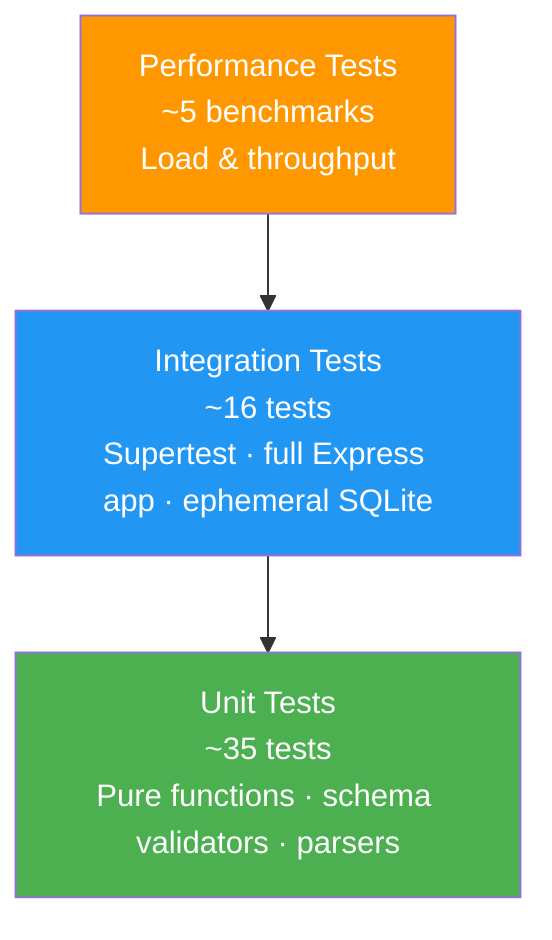
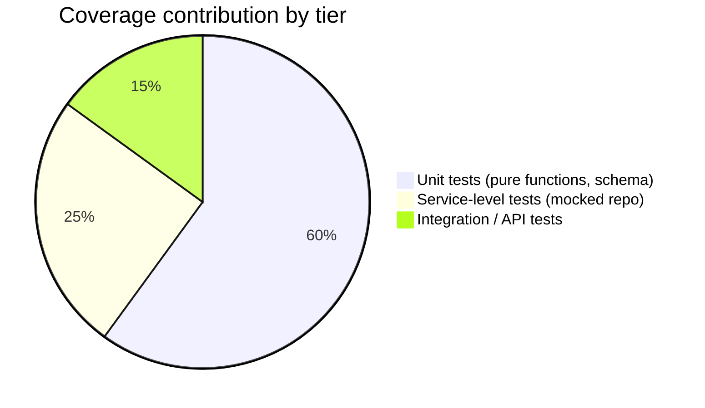
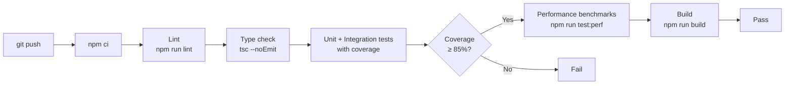

# Testing Guide — Intelligent Customer Support Ticket System

Audience: QA engineers, contributors, and CI pipeline maintainers.

---

## Table of Contents

1. [Test Pyramid](#1-test-pyramid)
2. [Running Tests](#2-running-tests)
3. [Test Structure](#3-test-structure)
4. [Test File Descriptions](#4-test-file-descriptions)
5. [Fixtures & Sample Data](#5-fixtures--sample-data)
6. [Coverage Requirements](#6-coverage-requirements)
7. [Manual Testing Checklist](#7-manual-testing-checklist)
8. [Performance Benchmarks](#8-performance-benchmarks)
9. [CI Pipeline](#9-ci-pipeline)

---

## 1. Test Pyramid



**Guideline:** Write unit tests first. They are fast, have zero setup, and produce the bulk of coverage. Integration tests validate the wiring. Performance tests verify regressions do not slip in.

---

## 2. Running Tests

### Prerequisites

```bash
# Install dependencies (first time)
npm install

# Copy environment file (SQLite is used automatically in test mode)
cp .env.example .env
```

### Test commands

```bash
# Run all tests
npm test

# Run all tests with coverage report (fails CI if < 85%)
npm run test:cov

# Run only unit tests
npm run test:unit

# Run only integration tests
npm run test:integration

# Run performance benchmarks
npm run test:perf

# Watch mode (re-runs on file change)
npm run test:watch

# Open the HTML coverage report after running test:cov
open coverage/index.html        # macOS
xdg-open coverage/index.html   # Linux
```

### Environment used during tests

`NODE_ENV=test` is set automatically by the npm test scripts. In this mode:
- Database uses an in-memory SQLite instance (`:memory:`), freshly migrated before the suite.
- Pino log level is raised to `silent` to avoid noise in test output.
- Rate limiting is disabled so tests can fire as many requests as needed.

---

## 3. Test Structure

```
tests/
├── unit/
│   ├── ticket.model.test.ts        # Zod schema validation (9 tests)
│   ├── categorization.test.ts      # Classification engine (10 tests)
│   ├── import.csv.test.ts          # CSV parser (6 tests)
│   ├── import.json.test.ts         # JSON parser (5 tests)
│   └── import.xml.test.ts          # XML parser (5 tests)
├── integration/
│   ├── tickets.api.test.ts         # All REST endpoints via Supertest (11 tests)
│   └── workflow.test.ts            # End-to-end lifecycle scenarios (5 tests)
├── performance/
│   └── benchmarks.test.ts          # Throughput and latency benchmarks (5 tests)
└── fixtures/
    ├── sample_tickets.csv          # 50 valid tickets
    ├── sample_tickets.json         # 20 valid tickets
    ├── sample_tickets.xml          # 30 valid tickets
    └── invalid/
        ├── missing_columns.csv     # CSV with required columns removed
        ├── bad_email.csv           # CSV with malformed email values
        ├── unterminated.json       # JSON with syntax error (no closing bracket)
        ├── wrong_enums.json        # JSON with invalid category/priority values
        ├── no_root.xml             # XML missing root <tickets> element
        └── entities.xml            # XML with entity expansion attempt (security)
```

---

## 4. Test File Descriptions

### `ticket.model.test.ts` — 9 tests

Tests every constraint of `TicketCreateSchema` in isolation.

| # | Test |
|---|---|
| 1 | Valid minimal payload passes validation |
| 2 | Missing required field `customer_email` fails |
| 3 | Invalid email format fails |
| 4 | `subject` below 1 character fails |
| 5 | `subject` above 200 characters fails |
| 6 | `description` below 10 characters fails |
| 7 | `description` above 2000 characters fails |
| 8 | Invalid `category` enum value fails |
| 9 | Invalid `priority` enum value fails |

---

### `categorization.test.ts` — 10 tests

Tests the pure `categorize()` and `prioritize()` functions.

| # | Test |
|---|---|
| 1 | "can't access my account" → `account_access`, `urgent` |
| 2 | "payment failed on invoice" → `billing_question`, `medium` |
| 3 | "production is down" → `technical_issue`, `urgent` |
| 4 | "please add dark mode" → `feature_request`, `low` |
| 5 | "bug: crash when uploading files" → `bug_report`, `medium` |
| 6 | "login blocked asap" → `account_access`, `high` |
| 7 | No matching keywords → `other`, `medium`, low confidence |
| 8 | Tie between two categories → falls back to `other` with low confidence |
| 9 | Confidence score is between 0 and 1 |
| 10 | Matched keywords array is non-empty when category is not `other` |

---

### `import.csv.test.ts` — 6 tests

Tests the CSV importer in isolation (no HTTP, no DB).

| # | Test |
|---|---|
| 1 | Valid 5-row CSV returns 5 parsed objects |
| 2 | Missing required column `subject` produces row-level error |
| 3 | Pipe-separated `tags` column is split into an array |
| 4 | BOM-prefixed UTF-8 CSV is parsed correctly |
| 5 | Empty CSV (header only) returns 0 rows and no errors |
| 6 | Completely malformed file (binary) throws `ImportParseError` |

---

### `import.json.test.ts` — 5 tests

| # | Test |
|---|---|
| 1 | Valid JSON array returns parsed objects |
| 2 | JSON object (not array) returns `ImportParseError` |
| 3 | Unterminated JSON throws `ImportParseError` |
| 4 | Empty array `[]` returns 0 rows |
| 5 | Extraneous unknown fields are stripped (not rejected) |

---

### `import.xml.test.ts` — 5 tests

| # | Test |
|---|---|
| 1 | Valid `<tickets><ticket>…</ticket></tickets>` structure is parsed |
| 2 | Missing `<tickets>` root element throws `ImportParseError` |
| 3 | XML entity expansion attempt is blocked (security: `processEntities: false`) |
| 4 | Empty `<tickets/>` returns 0 rows |
| 5 | Malformed XML (unclosed tag) throws `ImportParseError` |

---

### `tickets.api.test.ts` — 11 tests

Uses Supertest against the full Express app with an in-memory DB.

| # | HTTP | Scenario |
|---|---|---|
| 1 | `GET /health` | Returns 200 + status ok |
| 2 | `POST /tickets` | Valid body → 201 + ticket with UUID |
| 3 | `POST /tickets` | Missing required field → 400 + error details |
| 4 | `POST /tickets?auto_classify=true` | Category and priority are auto-set |
| 5 | `GET /tickets` | Returns paginated list |
| 6 | `GET /tickets?category=billing_question` | Filter returns only matching tickets |
| 7 | `GET /tickets/:id` | Returns correct ticket |
| 8 | `GET /tickets/:id` | Non-existent ID → 404 |
| 9 | `PUT /tickets/:id` | Updates fields; `updated_at` changes |
| 10 | `PUT /tickets/:id` | Transitioning to `resolved` sets `resolved_at` |
| 11 | `DELETE /tickets/:id` | Returns 204; subsequent GET returns 404 |

---

### `workflow.test.ts` — 5 integration tests

End-to-end scenarios using Supertest + real import files from `fixtures/`.

| # | Scenario |
|---|---|
| 1 | **Full lifecycle**: create → get → update to `in_progress` → auto-classify → update to `resolved` → verify `resolved_at` is set |
| 2 | **Bulk import + classify**: POST `sample_tickets.csv` with `auto_classify=true`; verify successful count and category distribution |
| 3 | **Concurrent creation**: 20 simultaneous `POST /tickets` requests; assert all return 201 and IDs are unique |
| 4 | **Combined filtering**: seed 30 known tickets; query with `category` + `priority` + `page` + `pageSize`; assert exact rows |
| 5 | **Partial import failure**: POST CSV with 10 valid + 3 invalid rows; assert `successful: 10`, `failed: 3`, error details correct |

---

### `benchmarks.test.ts` — 5 performance tests

Uses Vitest's `bench` API. Targets are documented in [Performance Benchmarks](#8-performance-benchmarks).

| # | Benchmark |
|---|---|
| 1 | Single ticket create — p95 latency |
| 2 | 1,000-row CSV import — rows/second throughput |
| 3 | `categorize()` pure function — calls/second |
| 4 | `GET /tickets` with 10,000 seeded rows + category filter — p95 latency |
| 5 | 100 concurrent requests sustained for 10 seconds — error rate |

---

## 5. Fixtures & Sample Data

Fixtures live in `tests/fixtures/`. The valid sample files are also the required deliverable data files.

| File | Format | Rows | Purpose |
|---|---|---|---|
| `sample_tickets.csv` | CSV | 50 | Valid import, performance tests |
| `sample_tickets.json` | JSON | 20 | Valid import |
| `sample_tickets.xml` | XML | 30 | Valid import |
| `invalid/missing_columns.csv` | CSV | 5 | Tests missing-column error reporting |
| `invalid/bad_email.csv` | CSV | 5 | Tests email validation in importer |
| `invalid/unterminated.json` | JSON | — | Tests parse error handling |
| `invalid/wrong_enums.json` | JSON | 5 | Tests enum validation in importer |
| `invalid/no_root.xml` | XML | — | Tests malformed XML handling |
| `invalid/entities.xml` | XML | — | Tests XXE protection |

### Generating fixtures programmatically

```bash
# Generate fresh sample data (script in scripts/generate-fixtures.ts)
npm run fixtures:generate
```

---

## 6. Coverage Requirements

Coverage is enforced via thresholds in `vitest.config.ts`:

```ts
coverage: {
  provider: 'v8',
  thresholds: {
    lines: 85,
    functions: 85,
    branches: 80,
    statements: 85,
  },
}
```

The CI pipeline fails if any threshold is not met. The HTML report is produced at `coverage/index.html`.

### Coverage strategy



- **Unit tests** target pure modules: categorizer, prioritizer, all three parsers, and Zod schema constraints. These are cheap to write and give the most coverage per line.
- **Service-level tests** mock the repository with a Vitest `vi.fn()` spy and verify orchestration logic: auto-classify on create, manual override guard, bulk-insert batching.
- **Integration tests** verify the full stack. They cover middleware chains, error handler mapping, and database interactions.

---

## 7. Manual Testing Checklist

Use this checklist when verifying a deployment or a significant feature change.

### Setup

- [ ] `npm install` completes without errors
- [ ] `.env` file is present and populated
- [ ] `npx prisma migrate dev` completes without errors
- [ ] `npm run dev` starts the server and logs `Listening on port 3000`
- [ ] `GET http://localhost:3000/health` returns `{ "status": "ok" }`

### CRUD

- [ ] Create a ticket with all required fields → `201` response with UUID
- [ ] Create a ticket with missing `customer_email` → `400` with field-level error
- [ ] Create a ticket with `description` < 10 chars → `400` with field-level error
- [ ] Create a ticket with `?auto_classify=true` → response has non-null `category` and `priority`
- [ ] `GET /tickets` returns paginated list with `pagination` object
- [ ] `GET /tickets?category=billing_question` returns only billing tickets
- [ ] `GET /tickets/:id` with a valid ID → `200` with ticket
- [ ] `GET /tickets/:id` with unknown ID → `404`
- [ ] `PUT /tickets/:id` with `status: "resolved"` → `resolved_at` is set in response
- [ ] `DELETE /tickets/:id` → `204`; subsequent `GET` → `404`

### Bulk Import

- [ ] Upload `sample_tickets.csv` → `201` with `successful: 50`
- [ ] Upload `sample_tickets.json` → `201` with `successful: 20`
- [ ] Upload `sample_tickets.xml` → `201` with `successful: 30`
- [ ] Upload `invalid/missing_columns.csv` → `201` with `failed > 0` and error details
- [ ] Upload `invalid/unterminated.json` → `400` with `IMPORT_PARSE_ERROR`
- [ ] Upload a `.pdf` file → `415` with `UNSUPPORTED_MEDIA_TYPE`
- [ ] Upload a file > 10 MB → `413`

### Auto-Classification

- [ ] `POST /tickets/:id/auto-classify` on a new ticket → `200` with `confidence > 0`
- [ ] `PUT /tickets/:id` with `classification_overridden: true` then `POST /auto-classify` → `409`
- [ ] Same as above with `?force=true` → `200` re-classifies

### Security / Hardening

- [ ] Response headers include `X-Content-Type-Options`, `X-Frame-Options` (set by helmet)
- [ ] Upload `invalid/entities.xml` → `400` or successful parse with no entity expansion
- [ ] Send 150 requests to any endpoint in < 60 seconds from the same IP → 429 on excess requests

---

## 8. Performance Benchmarks

These targets represent acceptable performance on a mid-tier developer machine (4-core, 16 GB RAM). CI records benchmark results but does not fail on them; regressions are flagged in PR review.

| Benchmark | Target | Metric |
|---|---|---|
| Single ticket create | < 20 ms | p95 response time |
| 1,000-row CSV import | > 500 rows/sec | throughput |
| `categorize()` pure function | > 50,000 calls/sec | throughput |
| `GET /tickets` with 10k rows + filter | < 50 ms | p95 response time |
| 100 concurrent requests / 10 sec | 0% | error rate |

Benchmarks are run with:

```bash
npm run test:perf
```

Results are appended to `docs/benchmark-results.md` on each run (by the benchmark script).

---

## 9. CI Pipeline

The pipeline runs on every pull request and push to `main`.



Steps:

1. `npm ci` — clean install from lockfile
2. `npm run lint` — ESLint (typescript-eslint ruleset)
3. `tsc --noEmit` — TypeScript type check (no emit, just errors)
4. `npm run test:cov` — all tests with V8 coverage; fails if any threshold is not met
5. `npm run test:perf` — benchmark run (informational, does not fail the pipeline)
6. `npm run build` — compile TypeScript to `dist/`

Coverage report is uploaded as a CI artifact and the summary is posted as a PR comment.
