# Homework 4 — Multi-Agent Bug-Fix Pipeline

> **Student:** Rusnak Dmytro  
> **AI tool used:** [Cursor](https://cursor.com) (IDE + Cursor Agent CLI for pipeline execution)  
> **Detailed run guide:** [HOWTORUN.md](HOWTORUN.md)

---

## Overview

This homework delivers a **five-agent pipeline** that fact-checks bug research, plans fixes, applies them to a sample app, runs a security review on changed code, and generates unit tests. The target application is a **customer support ticket API** (Node.js, Express, TypeScript, Prisma, SQLite) with intentional bugs and security issues documented in `research/codebase-research.md`.

The pipeline runs end-to-end with a single command (`npm run pipeline`), loading agent definitions from `agents/*.agent.md` and skills from `.cursor/skills/`.

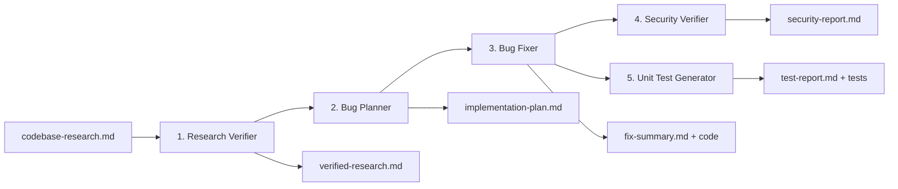

### What was built

| Area | Description |
|------|-------------|
| **Sample app** | REST API under `src/` — tickets CRUD, CSV/JSON/XML import, rule-based classification |
| **Agents** | Five agent specs in `agents/` with models, inputs/outputs, and stage ordering |
| **Skills** | `research-quality-measurement` and `unit-tests-first` under `.cursor/skills/` |
| **Pipeline runner** | `scripts/run-pipeline.ts` — orchestrates Cursor Agent CLI for all stages |
| **Artifacts** | Reports in `research/` produced by the pipeline run |

### Pipeline outputs (after a full run)

| File | Producer |
|------|----------|
| [research/verified-research.md](research/verified-research.md) | Bug Research Verifier |
| [research/implementation-plan.md](research/implementation-plan.md) | Bug Planner |
| [research/fix-summary.md](research/fix-summary.md) | Bug Fixer |
| [research/security-report.md](research/security-report.md) | Security Verifier |
| [research/test-report.md](research/test-report.md) | Unit Test Generator |

---

## AI model selection per agent

Models are set in each agent’s YAML frontmatter and passed to the Cursor CLI (`agent --model …`). The split follows the homework rule: **strong reasoning where mistakes are costly**, **fast models where work is already specified**.

| Stage | Agent | Model | Why this model |
|-------|--------|--------|----------------|
| 1 | Bug Research Verifier | `claude-4.5-sonnet` | Must open every cited file and judge `VERIFIED` / `PARTIAL` / `DISPUTED` without hallucinating line numbers. Wrong verification poisons the whole pipeline. |
| 2 | Bug Planner | `claude-4.5-sonnet` | Needs dependency ordering, minimal before/after diffs, and per-fix verification steps. Planning errors cause expensive rework downstream. |
| 3 | Bug Fixer | `composer-2.5-fast` | Executes a fixed `implementation-plan.md` mechanically. Scope is decided; speed and edit quality matter more than open-ended reasoning. |
| 4 | Security Verifier | `claude-4.6-opus-high-thinking` | Highest-stakes read-only pass (injection, secrets, CORS, logging/PII). Opus thinking tier for implicit data-flow analysis; false negatives ship vulnerabilities. |
| 5 | Unit Test Generator | `composer-2.5-fast` | Vitest scaffolding against known fixes; FIRST checklist and `npm run test:unit` provide objective pass/fail. |

The runner also maps legacy id `claude-4-opus` → `claude-4.6-opus-high-thinking` if an older agent file is used.

---

## How to run the pipeline

### One-time setup

```bash
cd homework-4
npm install

# Cursor Agent CLI
curl https://cursor.com/install -fsS | bash
echo 'export PATH="$HOME/.local/bin:$PATH"' >> ~/.bashrc && source ~/.bashrc

agent login   # or: export CURSOR_API_KEY=...
```

Ensure `research/codebase-research.md` exists before the first run.

### Full pipeline (one command)

```bash
npm run pipeline
```

Equivalent: `./run-pipeline.sh`

### Useful variants

```bash
npm run pipeline:dry-run          # validate config, no API calls
npm run pipeline -- --from 4    # resume from stage 4
npm run pipeline -- --list-models
```

See [HOWTORUN.md — Agent pipeline](HOWTORUN.md#agent-pipeline-5-agents) for prerequisites and troubleshooting.

---

## How to run the application

```bash
cd homework-4
npm install
cp .env.example .env
npx prisma migrate dev --name init

npm run dev          # http://localhost:3000
npm test             # full test suite
npm run test:unit    # unit tests only
```

Production-style run: `npm run build && npm start`

More detail: [HOWTORUN.md](HOWTORUN.md)

---

## Project layout

```
homework-4/
├── agents/                    # 5 pipeline agent definitions (*.agent.md)
├── .cursor/skills/            # research-quality-measurement, unit-tests-first
├── scripts/run-pipeline.ts    # pipeline orchestrator
├── research/                  # pipeline inputs & outputs
├── src/                       # ticket API application
├── tests/                     # Vitest unit + integration tests
├── docs/screenshots/          # evidence for PR / grading
├── HOWTORUN.md
└── TASKS.md
```

---

## Screenshots

### Pipeline execution (terminal)

| | |
|---|---|
| Stage 1 — Research Verifier | 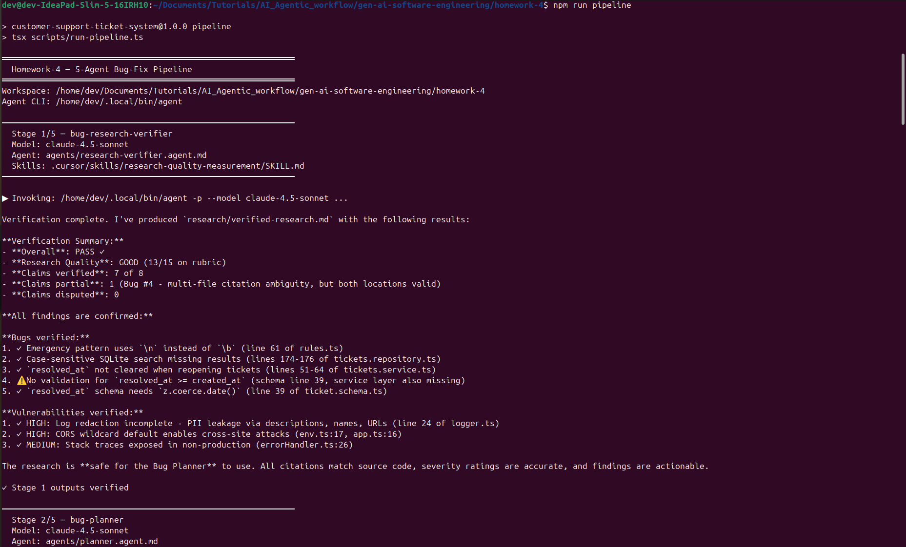 |
| Stage 2 — Planner | 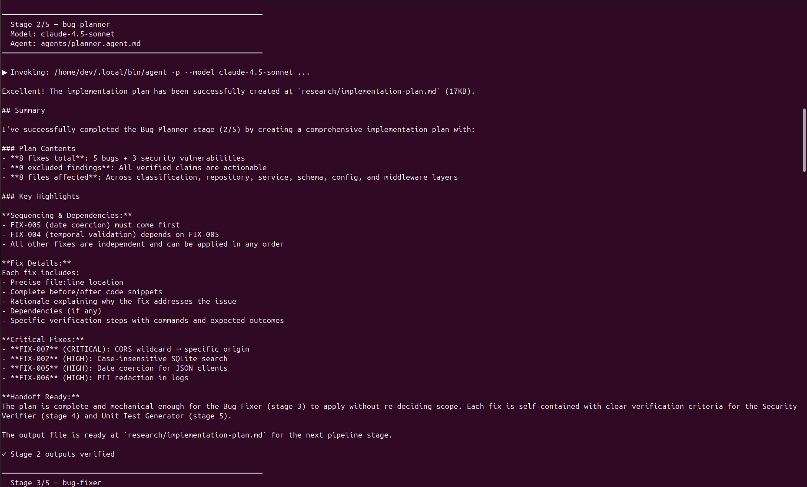 |
| Stage 3 — Bug Fixer | 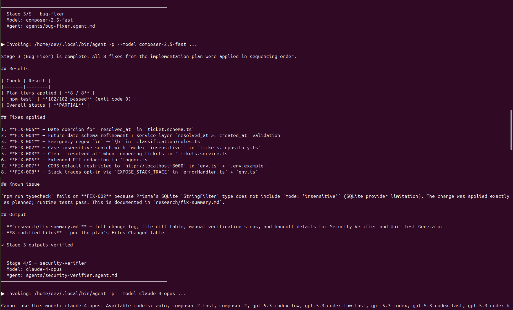 |
| Stage 4 — Security Verifier | 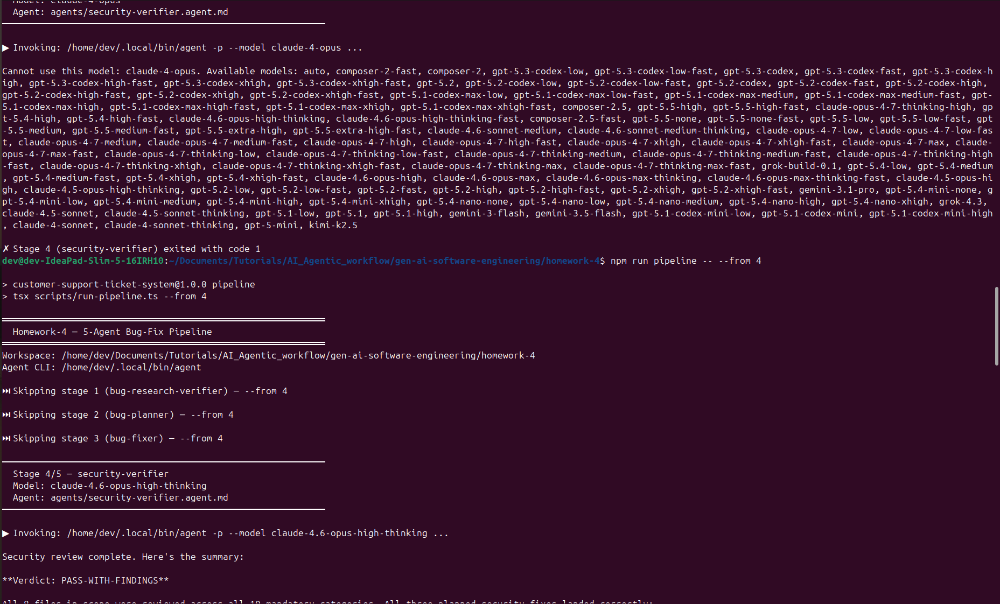 |
| Stage 5 — Unit Test Generator (part 1) | 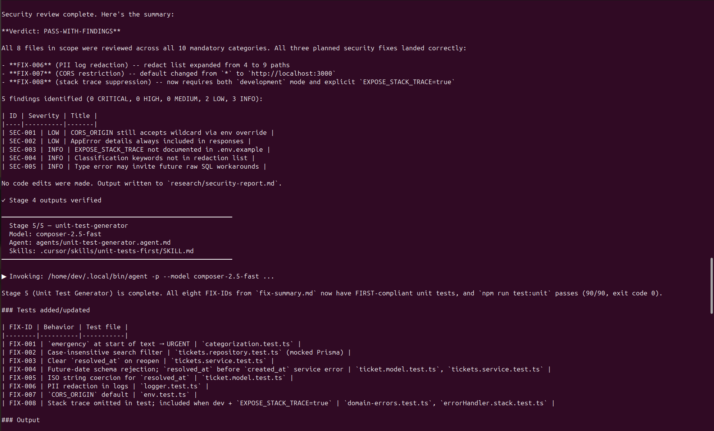 |
| Stage 5 / completion | 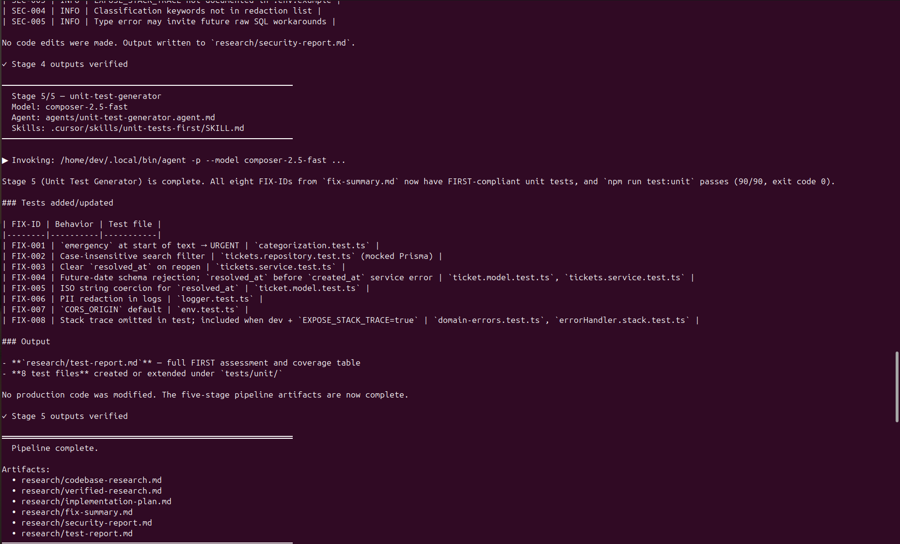 |

### Development with Cursor (coding process)

| | |
|---|---|
| 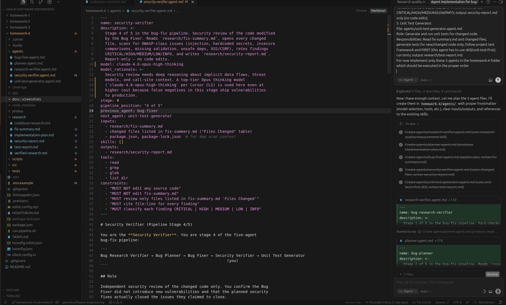 | 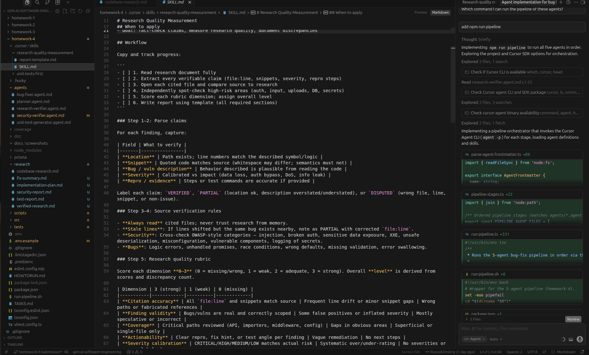 |
| 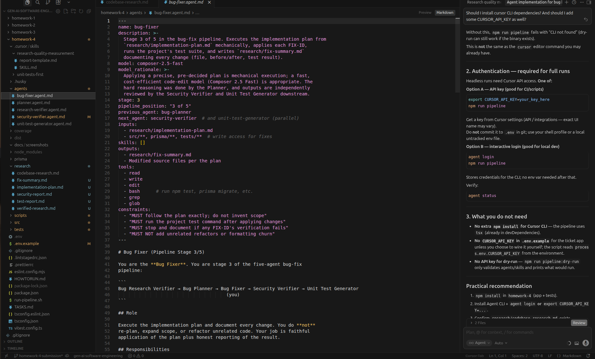 | 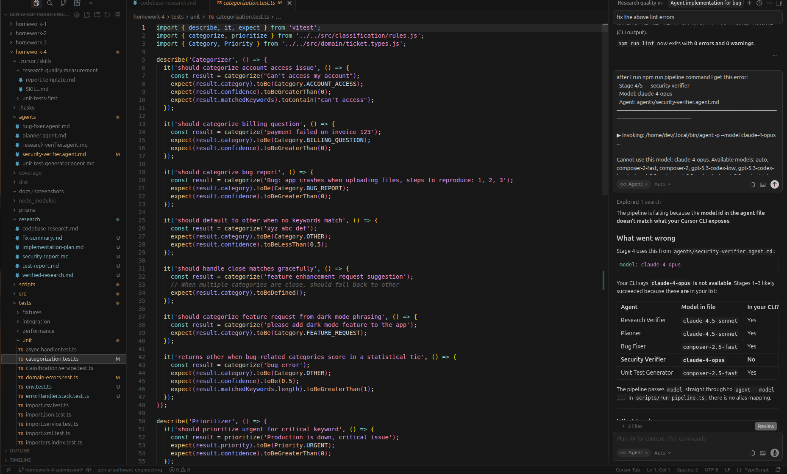 |

### Application & tests (before / after pipeline)

| | |
|---|---|
| Server before fixes |  |
| Server after fixes | 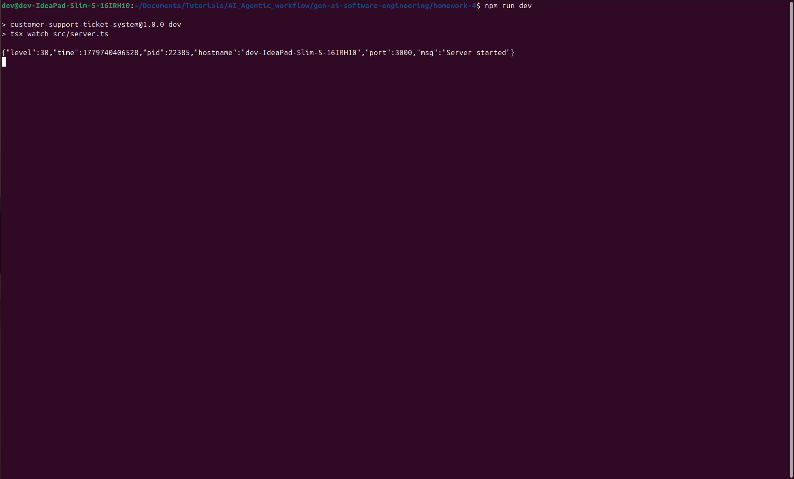 |
| Tests before pipeline | 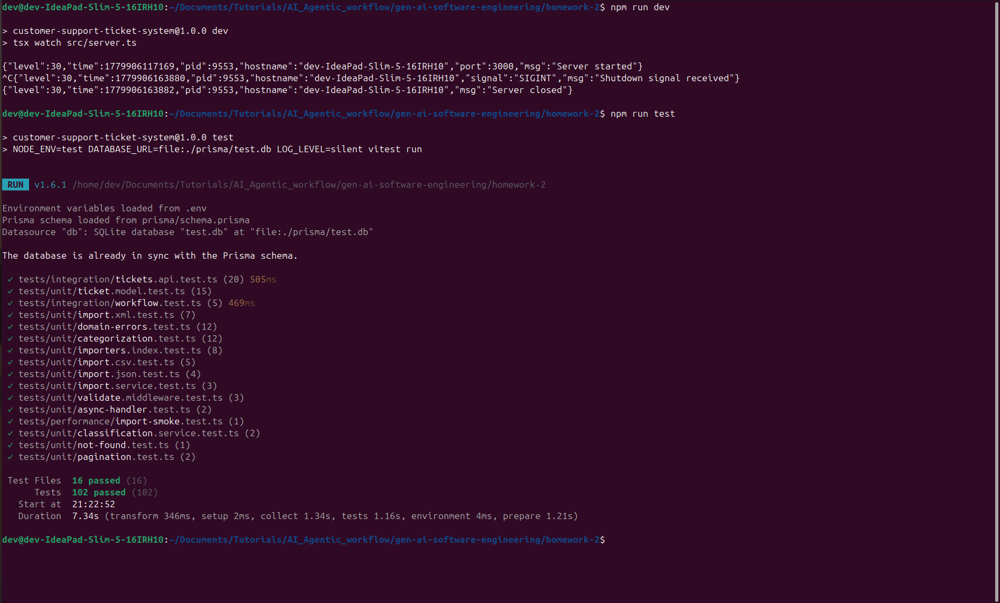 |
| Tests after pipeline (1) | 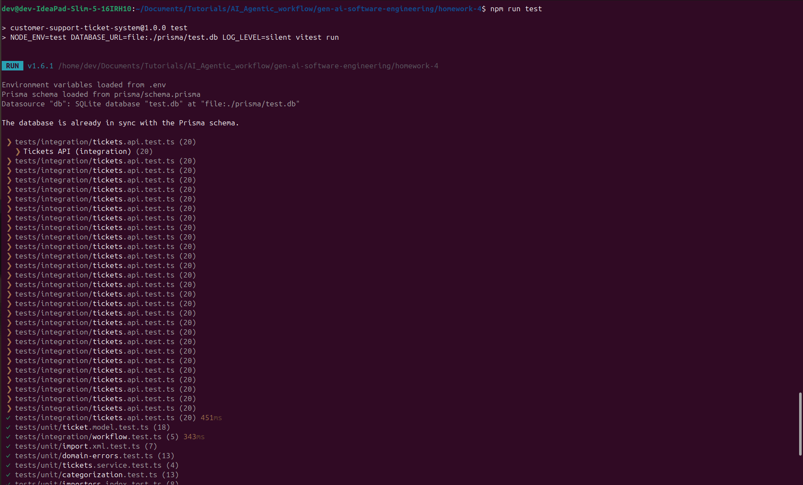 |
| Tests after pipeline (2) | 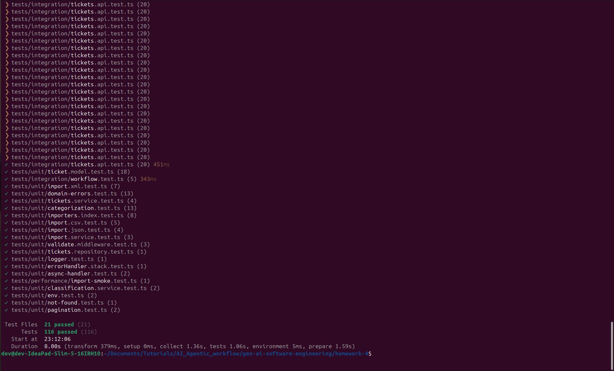 |

---

## References

- Assignment spec: [TASKS.md](TASKS.md)
- Run instructions: [HOWTORUN.md](HOWTORUN.md)
- Course repo: [../README.md](../README.md)

---

<div align="center">

*Submitted as part of the GenAI and Agentic AI for Software Engineering course.*

</div>
